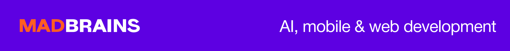
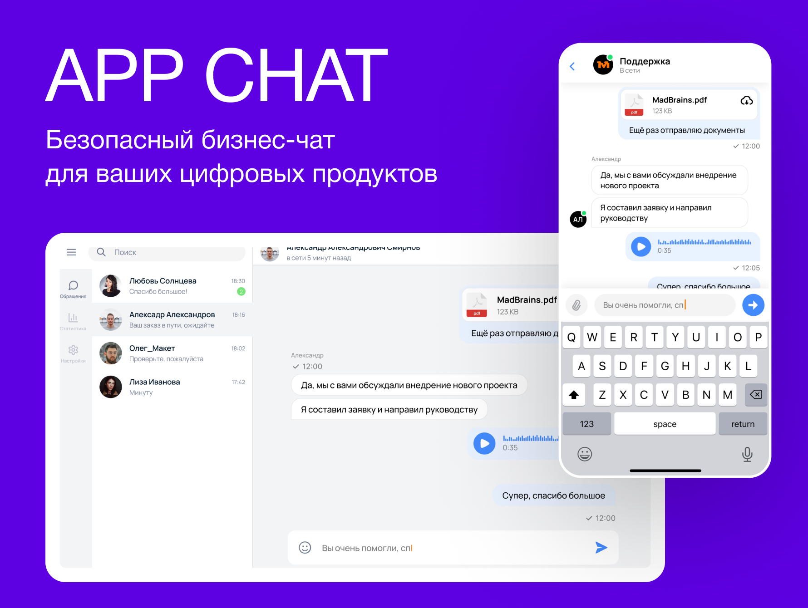

<a href="https://madbrains.ru/?utm_source=gthb"></a>
</a>

<p><h1 align="left" style="border-bottom: none">App Chat</h1></p>

<h4>Корпоративное веб-приложение для общения с поддержкой приватных и групповых чатов,
гибкой ролевой модели, безопасной аутентификацией и WebSocket-уведомлениями.</h4>


<p>
<a href="https://madbrains.ru/?utm_source=gthb">
</a>
</p>

<!-- Футер -->
<div>
  <h5>Подписаться:</h5>
  <a href="https://github.com/MadBrains">
    
  </a>
</div>

---


---

## 📌 Назначение

AppChat предназначен для обмена сообщениями между пользователями внутри организации. Поддерживаются роли, права, локализация, журналирование изменений и работа в реальном времени через WebSocket.

---

## 🛠 Технологии

- Java 17, Spring Boot
- Spring Security (JWT)
- STOMP/WebSocket + SockJS
- Liquibase
- JPA (Hibernate)
- PostgreSQL
- OpenAPI (SpringDoc)
- Lombok, MapStruct
- Passay (валидация паролей)
- i18n (русский, английский)
- SMTP Email (Gmail)
- React + Vite (фронтенд)

---

## ⚙️ Требования

- Java 17
- PostgreSQL 14+
- Gradle 8+
- SMTP-учётные данные
- Порты: `8080` (HTTP), `5432` (PostgreSQL), `3000` (frontend)

---

## ⚙️ Конфигурация

Пример `.env`:
```env
SPRING_DATASOURCE_URL=jdbc:postgresql://localhost:5432/appchat
SPRING_DATASOURCE_USERNAME=admin
SPRING_DATASOURCE_PASSWORD=secret
SPRING_MAIL_USERNAME=youremail@gmail.com
SPRING_MAIL_PASSWORD=emailpassword
APP_JWT_SECRETKEY=your_secure_key
```

> ⚠️ Для Gmail может потребоваться включить "менее безопасные приложения" или использовать App Password.

---

## 🧩 Архитектура

- REST API: пользователи, роли, чаты, сообщения, права
- WebSocket API: сообщения, печать, прочтение, изменение темы
- Сервисный слой с транзакциями
- Журналирование действий (`change_log`, `entity_info`)
- Ролевая модель и `ExtendedPermissionType`
- Отдельный React frontend (`frontend/`)

---

## 🔐 Аутентификация

- JWT + Refresh токены
- Фильтры безопасности
- Поддержка `CLIENT` и `WORKER`
- Индивидуальные расширенные права пользователя

---

## 💬 Чаты и сообщения

- Приватные и групповые чаты
- Администраторы чатов
- Темы, иконки, уведомления
- Поддержка reply, read-status
- Уведомления через WebSocket

---

## 🗂 Модель данных

```
[User] ↔ [Role]       (ManyToMany)
[Role] ↔ [Permission] (ManyToMany)
[Chat] → [ChatMember] → [User] (ManyToMany через ассоциацию)
[Chat] → [Message]    (OneToMany)
```

---

## 🔄 Liquibase

- Конфигурация: `db/changelog/db.changelog-master.yaml`
- Версионированные миграции
- Начальные данные: роли, права, администратор

Применение миграций:
```bash
./gradlew liquibaseUpdate
```

---

## 🌐 Локализация

- Языки: русский, английский
- Язык определяется заголовком `Accept-Language`
- Файлы: `messages_ru.properties`, `messages_en.properties`

Добавление языка:
1. Добавить `messages_XX.properties` в `resources/messages`
2. Перезапустить приложение

---

## 🧪 Тестирование

```bash
./gradlew test
```

---

## 🚀 Сборка и запуск вручную

```bash
./gradlew bootRun
```

С переменными окружения:
```bash
SPRING_DATASOURCE_URL=... SPRING_DATASOURCE_USERNAME=... SPRING_DATASOURCE_PASSWORD=... SPRING_MAIL_USERNAME=... SPRING_MAIL_PASSWORD=... APP_JWT_SECRETKEY=... ./gradlew bootRun
```

---

## 🐳 Запуск через Docker Compose

```bash
docker-compose up --build
```

Структура:
- `backend/` — Spring Boot приложение
- `frontend/` — React-приложение
- `postgres` — база данных PostgreSQL

Примерный список портов:
- `8080` — backend API
- `3000` — frontend
- `5432` — PostgreSQL

---

## 🧰 Первый запуск

- Swagger UI: [http://localhost:8080/swagger-ui.html](http://localhost:8080/swagger-ui.html)
- Frontend UI: [http://localhost:3000/](http://localhost:3000)
- Администратор по умолчанию:
  - Email: `testtest@gmail.test`
  - Пароль: `password`

---

## 🔌 WebSocket

- Endpoint: `/ws-chat`
- Заголовок: `Authorization: Bearer <token>`
- Топики:
  - `/topic/messages/{chatId}`
  - `/user/queue/typing`
  - `/socket/app`

Пример подписки:
```javascript
stompClient.subscribe('/topic/messages/123', (message) => {
  console.log('New message:', JSON.parse(message.body));
});
```

---

## 📚 Документация API

- Swagger UI: `http://localhost:8080/swagger-ui.html`
- Авторизация через JWT
- Группировка: `app-chat-api`

---

## Лицензия

Проект распространяется по двойной лицензии:

- **GNU GPLv3** — свободно для open-source и некоммерческого использования
- **Коммерческая лицензия** — для коммерческого применения, включения в проприетарные продукты или использования вне условий GPL

📩 По вопросам коммерческого использования и получения лицензии — пишите на **hello@madbrains.ru**

Подробнее — см. файлы [`LICENSE`](./LICENSE) и [`COMMERCIAL-LICENSE.md`](./COMMERCIAL-LICENSE.md)
